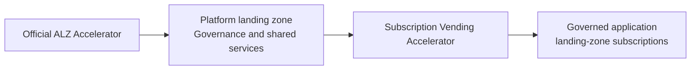
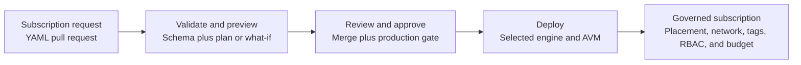
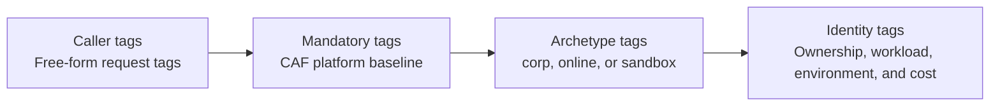

# Architecture

This document describes how subscription vending works end-to-end in this repo.

## Platform relationship

The official ALZ Accelerator runs first and establishes the platform landing
zone. This accelerator starts at the application landing-zone subscription
lifecycle and integrates with the existing platform.



The platform landing zone remains the source of truth for its hierarchy,
governance, connectivity, and shared services. Subscription vending consumes
those foundations and does not recreate them. See the
[product mandate](product-mandate.md).

## Components



`pr-validate.yml` discovers changed requests, runs a Terraform plan or Bicep
what-if for each subscription, and posts the preview on the pull request.
After merge and production approval, `apply.yml` invokes the selected engine.
The AVM vending pattern creates the subscription alias, associates the
management group, registers providers, optionally peers the hub, and applies
the requested governance settings.

## Engine layouts

The generated vending repository contains one selected runtime engine.
Terraform repositories use the single-folder layout below and maintain
isolated state per subscription.

```text
terraform/
├── archetypes.tf      # Declarative archetype defaults & guardrails (data only)
├── backend.tf         # azurerm backend, partial config (key set per-sub at init)
├── locals.tf          # Parses the sub YAML + applies archetype guardrails
├── main.tf            # ONE call to Azure/avm-ptn-alz-sub-vending/azure
├── outputs.tf
├── providers.tf
├── variables.tf       # Platform inputs (tenant, billing scope, MG IDs, hub VNet)
└── versions.tf
```

There are **no per-archetype Terraform modules**. All archetype behaviour is
data in `archetypes.tf`; the engine in `locals.tf` and `main.tf` is generic.

Bicep repositories contain `bicep/main.bicep`, nested budget modules, the
PowerShell request compiler, and `bicep/platform.json`. The workflow compiles
each YAML request into ARM parameters, validates it, runs what-if, and creates
a management-group deployment after approval.

### Terraform layout properties

| Goal | How it's achieved |
|---|---|
| DRY | One AVM module call. Archetype rules are data, not code |
| Per-subscription state | `terraform init -backend-config="key=<archetype>/<sub>.tfstate"` per CI job |
| Add new archetype | Update the Terraform archetype data, schema, and platform configuration |
| Add new sub | New `landingzones/<archetype>/<sub-name>.yaml`, open PR |
| Wide upgrade (e.g. bump module version) | `apply.yml` `workflow_dispatch` with `mode=all` |
| Guardrails | Archetype config can force workload, force hub peering, require budget |

## sub YAML schema

Use the [request contract](../landingzones/README.md) and
[JSON Schema](../landingzones/sub.schema.json) as the contract references.
The table below summarizes the architecture's request inputs.

Each subscription is described by a single flat file at
`landingzones/<archetype>/<sub-name>.yaml`. The filename (minus `.yaml`)
becomes the default `aliasName` and `displayName`.

| Key                  | Required | Type       | Notes |
|----------------------|----------|------------|-------|
| `archetype`          | yes      | string     | One of `corp`, `online`, `sandbox` |
| `location`           | yes      | string     | Azure region; **no default** |
| `owner`              | yes      | string     | Email/DL — emitted as `businessowner` tag, used for budget alerts |
| `costAllocationCode` | cond.    | string     | Operator-configurable (see [tagging.md](tagging.md)). Required only when enabled by platform policy. |
| `displayName`        | no       | string     | Defaults to filename (without `.yaml`) |
| `aliasName`          | no       | string     | Defaults to filename (without `.yaml`); **immutable after creation** |
| `workload`           | no       | string     | `Production` (default — always available) or `DevTest` (requires EA/MCA Dev/Test entitlement) |
| `costCenter`         | no       | string     | Stamped as `costcenter` tag |
| `billingScopeKey`    | no       | string     | Selects a configured billing scope; defaults to `default`. See [billing-scopes.md](billing-scopes.md). |
| `tags`                 | no       | map      | Free-form tags merged below mandatory, archetype, and identity tags. Reserved keys are rejected during engine validation. |
| `technicalResponsible` | no       | string   | Email; emitted as `technicalcontact` tag. Defaults to `owner` |
| `workloadName`         | no       | string   | Free-text workload/service name; emitted as `workloadname` tag. Defaults to `aliasName` |
| `network.enabled`      | no       | bool     | Default `false` |
| `network.addressSpace` | no       | list     | CIDRs for the spoke VNet |
| `network.hubPeering`   | no       | bool     | corp forces `true`; online/sandbox default per archetype config |
| `network.subnets`      | no       | map      | Passed through to the AVM module |
| `budget.amount`        | cond.    | number   | Required for sandbox; optional otherwise |
| `budget.contacts`      | no       | list     | Extra emails (owner is added automatically) |
| `roleAssignments`      | no       | map      | Passed to Terraform AVM or normalized to the supported Bicep AVM shape |
| `managedIdentity`      | no       | object   | `{ name, resourceGroupName? }` to create a UMI |

## Tag layering

Tag names match the platform LZ (`alz-core/platform-landing-zone.auto.tfvars`)
so cross-boundary tooling and reporting works seamlessly.

Merged in this order (later wins on conflict — governed tags ALWAYS win):



Reserved caller keys are rejected. The mandatory layer supplies `managedby`,
`source`, and `deployedby`. The final governed layer supplies ownership,
technical contact, cost center, workload, environment, and the configured
cost-allocation tag.

See [docs/tagging.md](tagging.md) for the full CAF baseline and customization
guide.

## State and deployment records

- Terraform uses the platform state storage account with a dedicated
  `subvending-tfstate` container and a per-subscription key:
  `<archetype>/<sub-name>.tfstate`.
- Bicep uses Azure management-group deployment history and does not use the
  Terraform state container for day-2 vending.
- See [state-storage.md](state-storage.md) for the Terraform backend.

## Engine module references

The Terraform engine wraps **`Azure/avm-ptn-alz-sub-vending/azure`**, pinned to `0.3.2`
exact in `terraform/main.tf` (no upper-bound
constraint — every bump is an explicit, reviewed change because the AVM
module's input contract is still pre-1.0). The mapping from the sub YAML
to AVM inputs lives in `terraform/locals.tf`. The full upstream input
reference: <https://registry.terraform.io/modules/Azure/avm-ptn-alz-sub-vending/azure/latest>.

The Bicep engine wraps
**`br/public:avm/ptn/lz/sub-vending:0.8.0`** in `bicep/main.bicep`. Its adapter normalizes the shared
YAML contract to the supported Bicep AVM inputs and rejects fields that the
pinned AVM version cannot preserve.
